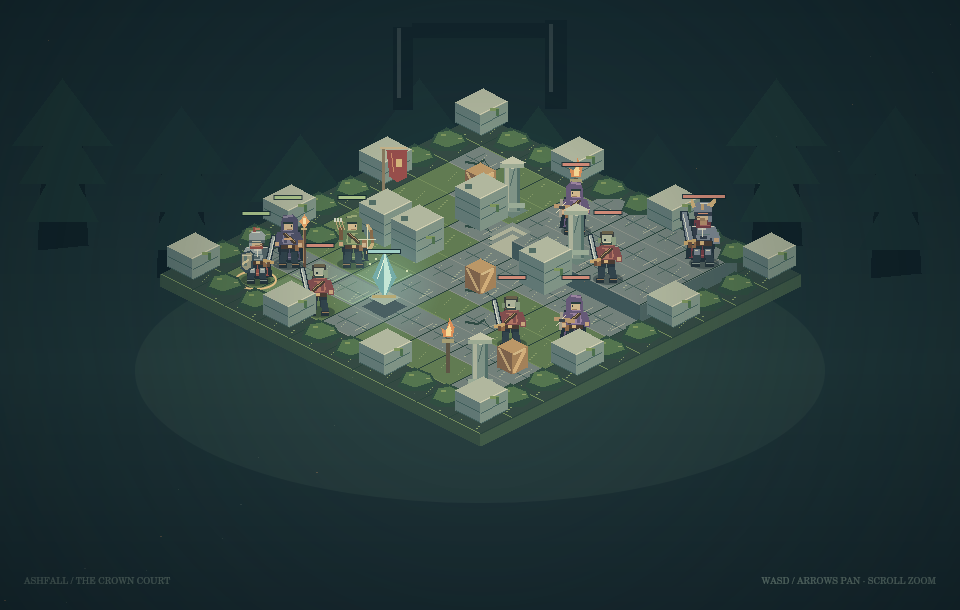
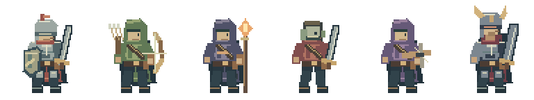

# Ashen Crown: Last Stand

Three defenders. One last barrier. An original isometric tactical RPG by **Wild Strokes**, built for the browser with JavaScript and Canvas 2D.

**[Play the game](https://strokeswild08.github.io/ashen-crown/)** · **[More art & code projects](https://strokeswild08.github.io/projects/)**



## The battle

Ashfall has fallen. Rowan, Lyra and Kael must defeat the Dark Commander before the crown crystal breaks. One 10 × 10 battlefield contains raised stone platforms, stairs, broken walls, crates, pillars, cover and overgrown fortress edges. Three raiders, two crossbow guards and the commander hold the far side.

The game has a title screen, a short introduction, an in-game guide, pause / restart, player and enemy phases, a commander health bar, crystal protection and victory / defeat results. A deliberate first run is designed around a short 10–15 minute session; the actual time depends on planning. An efficient run takes fewer rounds.

## Update 1.1

- Movement routes show their cost before you move.
- Flame Burst and Piercing Arrow show their affected cells and targets.
- Targeting works through overlapping allied sprites at all zoom levels.
- Battle results have clear status text and replay controls.
- Game help and this guide use English throughout.

## Your squad

| Hero | HP | Move | Attack | Defense | Role |
| --- | ---: | ---: | ---: | ---: | --- |
| Rowan · Knight | 120 | 4 | 28 | 8 | Adjacent attacks, shield push and defensive stance |
| Lyra · Ranger | 80 | 5 | 24 | 3 | Bow range 5, straight piercing shots and extra movement |
| Kael · Ember Mage | 70 | 4 | 30 | 2 | Spell range 4, area damage and an ally shield |



Each hero has a movement budget and one finishing action per player phase. Movement can be split into smaller steps. A basic attack, Shield Bash, Guardian Stance, Piercing Arrow, Flame Burst, Ember Shield or Wait finishes the hero. **Quick Step** is the exception: it adds 2 movement without spending Lyra’s attack. When all living heroes finish, enemies move and act one at a time.

## Abilities

| Ability | Effect | Range | Cooldown |
| --- | --- | ---: | ---: |
| Steel Slash | 28 physical power against an adjacent enemy | 1 | None |
| Shield Bash | 17 power; pushes one cell if clear | 1 | 2 rounds |
| Guardian Stance | +10 defense until the next player phase | Self | 2 rounds |
| Arrow Shot | 24 physical power; requires line of sight | 5 | None |
| Piercing Arrow | 34 power through enemies in one straight row / column; walls stop it | 5 | 3 rounds |
| Quick Step | +2 movement now; keeps the attack available | Self | 3 rounds |
| Fire Bolt | 30 magic power; reduced armor impact | 4 | None |
| Flame Burst | 33 magic power within a one-cell diamond; allies are safe | 4 | 3 rounds |
| Ember Shield | An ally takes 8 less incoming damage until the next player phase | 3 | 2 rounds |

Displayed power is before armor, cover and shields. Standing beside a wall, crate or pillar adds 3 defense against ranged physical attacks. Magic ignores 60% of defense. Critical hits have a 10% chance and apply 1.5× final damage. All damage has a minimum of 1. Cooldowns become ready when the indicated number of full rounds has elapsed.

The commander uses Heavy Strike, War Cry (+5 attack for nearby allies during the current enemy phase) and Ground Slam when multiple defenders / the crystal are adjacent. The ranged guards seek clear firing positions and move away from adjacent heroes. Enemies can target the crystal when it is closer than a defender.

## Controls

Select a hero from the map or squad panel. Choose **Move** and hover a green cell to preview the route, movement cost and remaining budget. Click to move. Choose **Attack** or an ability and click a valid target to preview it; click the same cell again or press **Confirm attack** to commit. Orange cells indicate valid hostile targets; blue indicates an Ember Shield target. Gold tiles preview the affected area or piercing line, and gold markers show affected enemies. Valid target tiles take priority over overlapping allied sprites. Click an enemy outside attack mode to inspect its stats.

| Input | Action |
| --- | --- |
| Click / tap | Select, move or preview a target |
| 1 / 2 / 3 | Select Rowan / Lyra / Kael |
| M / T / Q | Move / attack / abilities |
| Space | Wait with selected hero |
| WASD / arrow keys | Pan the camera |
| Mouse wheel / + and − buttons | Zoom |
| Pan button + drag | Pointer or touch camera movement |
| Recenter | Restore camera framing |
| Escape | Cancel target, then pause |

Sound starts off. Turn it on for synthesized movement, attacks, shields and results. No audio files or autoplay are used. Pausing freezes action animations and the enemy sequence. Leaving the page hidden pauses the battle. Restart begins a fresh match; no battle save is persisted.

## Run locally

```sh
cd ashen-crown
python3 -m http.server 8080
# open http://localhost:8080
npm test
npm run balance
```

No build step or external runtime dependency is required. Serve over HTTP because the source uses ES modules. The two preview PNGs are portfolio illustrations; gameplay draws the art from source.

## Code map

| File | Responsibility |
| --- | --- |
| `src/state.js` | Battle state, units, deterministic critical-hit RNG and outcomes |
| `src/grid.js` | Terrain, occupancy, breadth-first paths, range and line of sight |
| `src/characters.js` | Hero / enemy definitions and ability data |
| `src/turns.js` | Hero completion, cooldowns and round transitions |
| `src/combat.js` | Legal targets, damage, pushes, movement and abilities |
| `src/ai.js` | Melee approach, ranged positioning and commander decisions |
| `src/art.js` | Original pixel character sheets, terrain, props and SVG icons |
| `src/renderer.js` | Isometric drawing, pick detection, highlights, health and feedback |
| `src/preview.js` | Read-only route costs and ability impact previews |
| `src/camera.js` | Smooth pan / zoom transforms |
| `src/effects.js` | Animation clock, movement interpolation, particles and cancellable delays |
| `src/audio.js` | Web Audio sound cues |
| `src/ui.js` | Squad, actions, ability descriptions, preview and help |
| `src/app.js` | Menus, input, action sequencing and the game loop |
| `tests/rules.test.js` | Movement, combat, abilities, cover, phases, AI and endings |
| `tests/preview.test.js` | Route costs, impact shapes and overlapping target selection at multiple zoom levels |
| `scripts/balance.mjs` | Repeatable full-battle offensive policy across ten RNG seeds |

The map’s elevation is visual; it does not add height damage or climbing restrictions. This is a single complete battle, without an overworld, loot progression, multiplayer or a campaign. The balance script exercises the rules, not human play speed or every possible strategy.

Characters, terrain, interface icons and sound cues are created by this project. No third-party game art or game engine is loaded.
