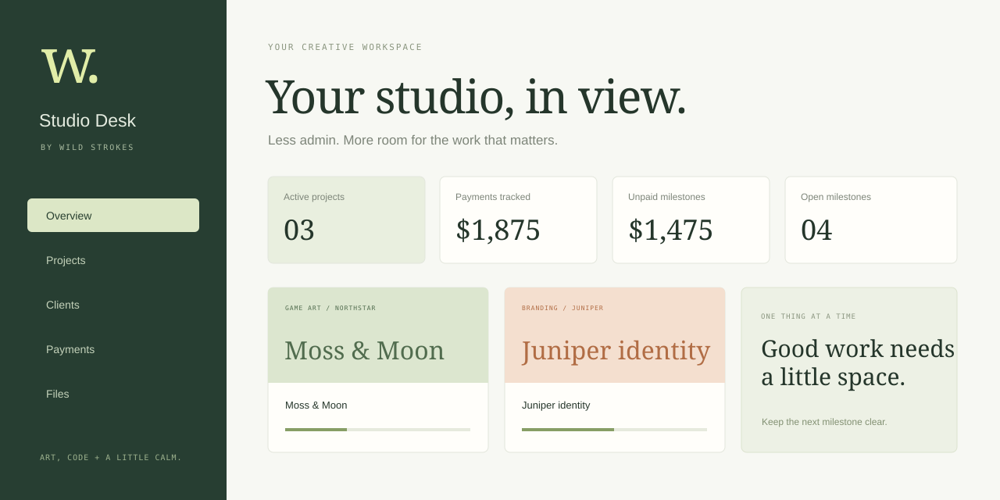

# Studio Desk — Freelance Client Portal



**[Try the public demo →](https://strokeswild08.github.io/client-portal/)**

A complete project-management workspace for independent creatives, with clients, briefs, deadlines, milestones, manually tracked payments, notes and file attachments. Vanilla JavaScript on the front end; Node.js and SQLite on the back end. No runtime dependencies.

## Two ways to use it

| Version | Accounts | Data and files |
| --- | --- | --- |
| **Public GitHub Pages demo** | No account required; clearly labeled demo | Fictional records and your changes stay in this browser's IndexedDB |
| **Full-stack server** | Real signup, sign-in and sign-out | Account-isolated SQLite records and private server-side attachments |

GitHub Pages serves static files; it does **not** run the backend. The live demo does not pretend to authenticate users or sync between devices. Run or deploy the included server to use real accounts and server storage.

## Run the full application

Requires **Node.js 24.x**. From this folder:

```sh
npm start
```

Open **http://127.0.0.1:3000/client-portal/** and create an account. The new account starts with an empty workspace. Add a client, create a project, allocate milestones, record payments and attach files.

No installation step is needed: the server uses Node's built-in HTTP, crypto and SQLite modules. Add `?demo=1` to the URL to inspect the browser demo on the same server.

## What works

- Overview with calculated active projects, paid/unpaid milestone totals and open tasks.
- Project creation/editing, category, status, brief, deadline, budget and cover color.
- Client creation/editing with contact details and project totals.
- Milestone creation/editing, completion toggles and payment status.
- Integer-cent monetary storage and budget-allocation validation.
- Upcoming deadline list, status filters and global client/project search.
- Per-project notebook with timestamped notes.
- File upload, authenticated download and removal; 5 MB per file, 25 MB per account.
- JSON export of workspace records; download attachments separately.
- Browser demo reset, local recovery, empty/error states and responsive navigation.
- Real backend sessions, password hashing, ownership checks and conflict detection.

Payments are manual records. This app does not charge cards, send invoices or connect to payment processors. Notes are workspace notes rather than messages sent to clients. Accounts are independent workspaces; shared client invitations are outside this version's scope.

## Architecture

| File | Responsibility |
| --- | --- |
| `index.html` / `style.css` | Accessible shell, responsive dashboard and forms |
| `app.mjs` | Views, dialogs, search, state changes and downloads |
| `lib/model.mjs` | Shared validation, money, progress and fictional demo data |
| `lib/repository.mjs` | Interchangeable IndexedDB and HTTP repositories |
| `server.mjs` | Authentication, SQLite persistence, uploads and static serving |
| `model.test.mjs` / `server.test.mjs` | Domain and end-to-end API tests |

The front end talks to a repository interface. The browser repository commits file bytes and metadata in the same IndexedDB transaction. The server repository uses authenticated JSON APIs and raw file transfers. Workspace updates carry a revision number so stale edits cannot silently overwrite another tab's changes.

## Backend details

- Passwords use scrypt with independent random 16-byte salts.
- Session tokens use 32 random bytes; only their SHA-256 digests are stored.
- Sessions expire after seven days and are revoked on sign-out.
- Cookies are HttpOnly and SameSite=Strict; HTTPS deployments enable Secure with `PUBLIC_ORIGIN`.
- Mutating endpoints require a custom header and validate provided Origin headers.
- SQL uses bound parameters. File access is scoped to the signed-in account.
- Uploads use generated identifiers as disk names and download as attachments.
- Static serving uses an explicit allowlist; source, database and uploads cannot be served as public files.
- Sign-in and signup attempts are rate-limited per connection IP.

## Run the checks

```sh
npm test
```

Tests cover monetary totals, invalid deadlines, foreign references, allocations, signup/login/logout, stale updates, origin checks, file byte integrity, cross-account isolation, restart persistence and static route protection.

## Deploying the backend

Use a Node.js 24 host with persistent storage, behind HTTPS. Configure the public origin and a data directory that persists between deployments:

```sh
HOST=0.0.0.0 PORT=3000 \
PUBLIC_ORIGIN=https://portal.example.com \
DATA_DIR=/persistent/studio-desk \
npm start
```

| Variable | Default | Purpose |
| --- | --- | --- |
| `HOST` | `127.0.0.1` | Listening address |
| `PORT` | `3000` | HTTP port |
| `DATA_DIR` | `./data` | SQLite database and private uploads |
| `PUBLIC_ORIGIN` | Local request origin | Exact external origin; enables Secure cookies on HTTPS |
| `ALLOW_SIGNUP` | `true` | Set `false` to close new account registration |

`data/` is excluded from git. Back up the SQLite database and uploads together. This version uses one SQLite file and one process; it does not include email verification, password reset, shared client roles or distributed rate limiting. Configure those features before expanding it into a multi-tenant service. The server requires HTTPS termination for public deployment.

## Browser demo

The demo seeds four fictional clients and projects. Changes survive refreshes in the same browser and origin; clearing browser storage removes them. Files are real local blobs, not placeholder links. If browser storage is blocked, the interface shows a recovery message rather than silently discarding edits. You can reset it from Workspace settings.

Keyboard: `Ctrl`/`Cmd` + `K` focuses desktop search. Forms use native required/email/number validation with shared validation on save. Monetary totals are always USD.

---

**Wild Strokes** · [Projects](https://strokeswild08.github.io/projects/) · [Discuss a paid project](mailto:strokeswild08@gmail.com)
