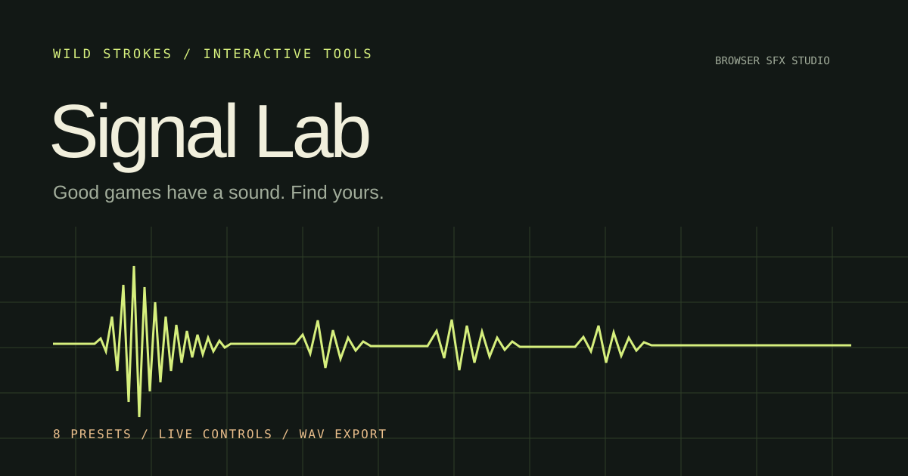

# Signal Lab — Game SFX Studio



**[Open the live sound studio →](https://strokeswild08.github.io/signal-lab/)**

A browser sound-design tool for game developers and artists. Start with a laser, coin, jump or portal; shape the oscillator, pitch, envelope and effects; export the result as a WAV. Built with vanilla JavaScript, Canvas and Web Audio, with no runtime dependencies.

## Features

- Eight starting presets for combat, movement, rewards, UI and world effects.
- Sine, triangle, square and saw oscillators with exponential pitch sweeps.
- Attack, noise, low-pass filter, saturation and four-tap echo controls.
- Waveform preview and playback position indicator.
- Deterministic seeded noise: a saved recipe produces the same samples.
- Bounded variations, preset reset and 40-step undo history.
- Mono 44.1 kHz, 16-bit PCM WAV export.
- Versioned JSON recipe import/export and automatic local session recovery.
- Responsive layout, labeled controls, keyboard shortcuts and reduced-motion support.

All synthesis, playback and recipe processing happen on the device. No audio assets, fonts, libraries or accounts are fetched by the tool.

## Run locally

From the repository root:

```sh
python3 -m http.server 8000
```

Open `http://localhost:8000/signal-lab/`. A local HTTP server is needed because the application uses JavaScript modules.

## Controls

| Control | Action |
| --- | --- |
| `1`–`8` | Select and audition a preset |
| `Space` | Play or stop the sound when focus is outside a control |
| Variation | Make a randomized variation of the current sound |
| Undo | Restore the previous preset or parameter change |
| Reset | Restore the selected preset's original settings |
| Download WAV | Export the currently displayed sound |
| Export / Import JSON | Save or restore a sound recipe |

The monitor slider affects playback only. Export levels are independent of the monitor volume. Browser audio starts after a click or key press.

## How it works

`synth.mjs` renders a mono `Float32Array`. The oscillator follows an exponential frequency sweep and blends with a seeded noise generator. An attack-decay-release envelope, one-pole low-pass filter, optional saturation and four discrete echo taps shape the signal. Peaks are limited before the fixed output gain is applied.

`app.mjs` handles the controls, state history, local persistence, visualization, Web Audio playback and downloads. Playback and export use the same rendered sample buffer, so the WAV matches the preview before monitor gain.

The WAV encoder writes a RIFF header and signed 16-bit little-endian PCM samples directly. JSON recipes carry a version number; imported numeric settings are bounded and invalid values fall back to defaults.

| File | Purpose |
| --- | --- |
| `index.html` | Semantic interface and controls |
| `style.css` | Responsive studio layout and visual design |
| `app.mjs` | Interaction, state, playback and waveform rendering |
| `synth.mjs` | Pure synthesis functions and WAV encoding |
| `synth.test.mjs` | Audio and file-format tests using Node's built-in runner |
| `cover.svg` | Repository preview graphic |

## Verify the engine

```sh
node --test signal-lab/synth.test.mjs
```

Tests cover every preset, sample finiteness and output limits, deterministic recipes, invalid settings and WAV metadata/data integrity.

## Scope

This is a compact procedural SFX tool, not a multitrack editor. Output is mono; recipes store synthesis parameters rather than recorded audio. Pulse and saw waves are intentionally raw and may alias at high pitches. The low-pass control softens their edges. Recipes and session recovery do not need a backend.

---

**Wild Strokes** · [More games and tools](https://strokeswild08.github.io/projects/) · [Discuss a paid project](mailto:strokeswild08@gmail.com)
