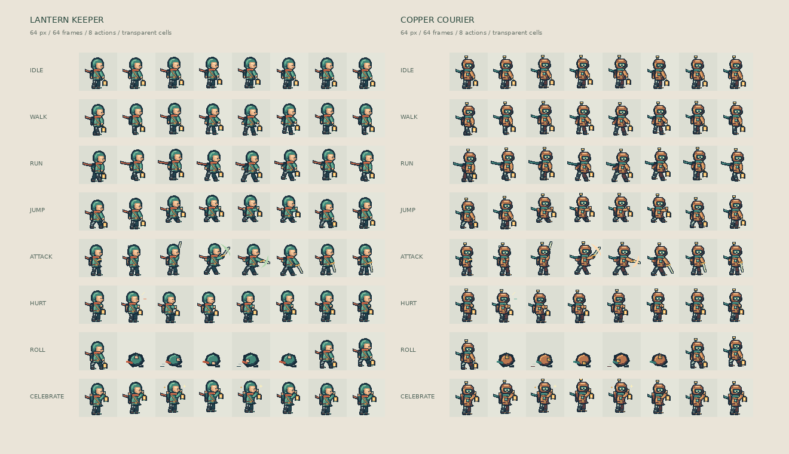
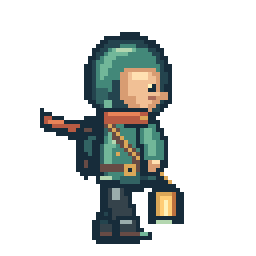
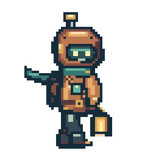

# Flipbook · Sprite animation workbench

A browser tool by Wild Strokes for checking sprite sheets before putting them into a game. Pick an animation row, tune its pace, inspect individual frames and export the clip as a transparent GIF.

**[Open Flipbook](https://strokeswild08.github.io/sprite-preview/)** · **[All live projects](https://strokeswild08.github.io/projects/)**

## Character sheets



| Character | Complete pack | Original sheet | Animation data |
| --- | --- | --- | --- |
| Lantern keeper | [Download ZIP](assets/keeper-character-pack.zip) | [Transparent PNG](assets/keeper-sheet.png) | [JSON atlas](assets/keeper-atlas.json) |
| Copper courier | [Download ZIP](assets/courier-character-pack.zip) | [Transparent PNG](assets/courier-sheet.png) | [JSON atlas](assets/courier-atlas.json) |

 

Each sheet is **512 × 512 px**, arranged as eight columns and eight rows of **64 × 64 px** cells. There is no padding. Both characters face right; mirror the sprite to face left. The ground pivot is `(32, 60)` within each cell. The lantern, scarf, clothing highlights and limb poses are drawn with integer pixels; exports contain no smoothing.

| Row | Action | FPS | Playback |
| --- | --- | --- | --- |
| 1 | Idle | 8 | Loop |
| 2 | Walk | 10 | Loop |
| 3 | Run | 14 | Loop |
| 4 | Jump | 10 | Once |
| 5 | Attack | 12 | Once |
| 6 | Hurt | 10 | Once |
| 7 | Roll | 12 | Once |
| 8 | Celebrate | 9 | Loop |

The JSON gives the source rectangle and duration for every frame, plus the loop flag and pivot. PNG is the game asset; the 4× GIFs are presentation previews. These are side-view animation sets, with one facing direction.

## Features

- Two complete 64 × 64 character sheets: Lantern keeper and Copper courier. Each has 64 frames across eight actions.
- Idle, walk, run, jump, attack, hurt, roll and celebrate, with named action buttons and individual playback rates.
- Complete downloadable character packs: transparent PNG sheet, animation JSON and eight action GIF previews.
- One-shot playback for jump, attack, hurt and roll; looping idle, walk, run and celebrate.
- Local static PNG / WebP import, file chooser or drag-and-drop.
- Frame width / height, row and first / last frame controls.
- Play once, forward, reverse and ping-pong loops; 1–60 FPS; play/pause and frame stepping.
- Zoom, transparency checker, paper / ink backdrops, onion skin and pixel grid.
- Click the sheet to inspect a frame; use the scrubber to step through the active clip.
- Transparent current-frame PNG, looping clip GIF and full-sheet PNG export.
- GIF encoding in a module worker, keeping preview controls responsive.
- Keyboard controls and reduced-motion support.

Your sheet stays in the browser. No upload, backend, analytics, account or CDN is used. The app does not save sheets between visits.

## Use your own art

Open a **static PNG or WebP**, then enter the dimensions of one frame. Frames must have a uniform size and no margin or padding between cells. Sheets are read left to right, row by row; one row is one clip. Any leftover pixels at the right / bottom are excluded, with a status message.

Import limits: 10 MB, 4,096 × 4,096 image dimensions, 4,096 grid cells, 2,048 × 2,048 per frame. The initial frame size is a provisional 32 px (larger for exceptionally large grids); set it to match your sheet.

Each clip can select up to 120 frames. GIF export allows up to 512 × 512 per output frame and eight million output pixels in total. Lower the export scale or shorten the clip if you reach that limit. PNG frames support up to 2,048 × 2,048 output pixels.

GIF preserves an exact palette when the clip has at most 255 opaque colors; more colorful clips are quantized to fit the format's 256-color limit. Alpha below 128 becomes transparent, alpha at or above 128 becomes opaque. GIF timing uses 10 ms units; high FPS is limited to a 20 ms frame duration for broad player compatibility. Use PNG for full alpha and color precision. Guides, backdrops and onion skin are never baked into exports.

## Run locally

No installation or build step is needed to run the browser app. Use a local HTTP server so ES modules and the export worker can load:

```sh
cd sprite-preview
python3 -m http.server 8000
```

Open `http://localhost:8000`. Do not launch the HTML directly using `file://`.

Tests run on a recent Node.js version, without npm dependencies:

```sh
npm test
```

## Controls

| Action | Control |
| --- | --- |
| Play / pause | Play button or Space with the preview focused |
| Previous / next frame | Arrow buttons or left / right arrow keys |
| Choose an individual frame | Click the sheet, or move the scrubber |
| Change the clip | Animation row and first / last frame inputs |
| Save the current pose | Frame PNG |
| Save the animation | Clip GIF |

## Code map

| File | Responsibility |
| --- | --- |
| `index.html` | The workbench controls and labels |
| `style.css` | Responsive layout and visual styling |
| `app.js` | File decoding, Canvas rendering, input, playback and downloads |
| `core.js` | Frame math, clip sequences, timing and size limits |
| `demos.js` | Integer-pixel character artwork, action poses and atlas metadata |
| `gif.js` | Exact pixel-art palettes and GIF encoding |
| `export-worker.js` | Runs GIF encoding outside the main UI thread |
| `tests/core.test.js` | Clip ordering, timing, limits and GIF structure checks |
| `vendor/gifenc.js` | gifenc 1.0.3, bundled locally; license in `vendor/LICENSE.md` |

Project code and demo art are published for inspection; no project-wide reuse license has been assigned. The bundled GIF encoder is third-party MIT-licensed code.

## Roman Urdu mein samjho

**Sprite sheet** ek image hoti hai jisme animation ke saare frames ek grid mein rakhe hote hain. Hamare character ki sheet 512 × 512 hai aur har frame 64 × 64 hai: 8 columns aur 8 action rows, yani 64 frames.

`core.js` frame ka number uski image position mein badalta hai. `app.js` us chhote rectangle ko Canvas par draw karta hai. 10 FPS par har 0.1 second ke baad agla frame dikhaya jata hai. Reverse mein list ulat jati hai; ping-pong mein frames aage ja kar wapas aate hain.

**Complete character pack** se ZIP download karo. Usmein asli transparent PNG, JSON frame data aur saari actions ki GIF previews milti hain. Game mein PNG aur JSON use karo. Action buttons se walk, jump, attack aur baqi poses dekho. Jump, attack, hurt aur roll ek baar chalte hain; Play dabao to dobara chalte hain.

`demos.js` mein integer-pixel polygons aur limb poses se character aur har action draw hota hai. `gif.js` selected frames ke colors ko palette mein rakhta hai aur GIF banata hai. Export worker ye kaam background mein karta hai. PNG sirf current pose save karta hai; GIF poora selected clip save karta hai.
