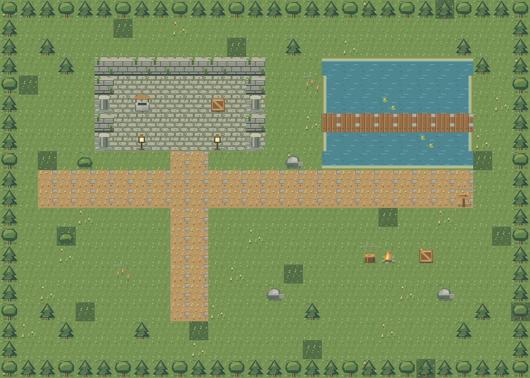

# Fieldwork — Tilemap Studio

A small-world editor by **Wild Strokes**. Paint a landscape, give it boundaries, then walk through it. Built with vanilla JavaScript and Canvas 2D. No account, backend, build step or runtime dependency.

**[Open the editor](https://strokeswild08.github.io/tilemap-editor/)** · **[More projects](https://strokeswild08.github.io/projects/)**



[Example project JSON](assets/lantern-garden.json) · [32 px tileset PNG](assets/tileset.png)

## What you can do

- Start with the old lantern garden or a blank 4–64 cell map.
- Paint terrain and objects on separate layers. Use erase, flood fill, filled rectangles and tile picking.
- Mark collision manually or automatically for the built-in solid tiles. Painting art never forces you to use auto collision.
- Place a spawn and walk with WASD / arrows. The walker checks its body against blocked cells.
- Undo / redo whole strokes, imports, new maps and resizing. There are up to 60 history entries.
- Import one local PNG / WebP tilesheet (16, 32, 48 or 64 px cells), then paint custom tiles on either art layer.
- Save / reopen a portable project JSON, export visible art as a transparent PNG, or download the built-in tileset.
- Restore your last project from browser storage. Save a JSON copy when you need a portable backup.

## Quick start

Choose a tile on the left. Drag across the map with **Paint**. The tile chooses its natural ground / object layer; choose another layer if needed. **Rectangle** fills the dragged region. **Fill** replaces connected cells with the same tile ID on the active layer. **Pick** samples a cell. Right-click temporarily erases.

Select **Collision** to paint blocked cells; Erase clears them. Orange squares are an editor guide. **Auto collision** recomputes the edited cell from the solid ground and object tiles; turn it off to preserve your manually assigned collision. Custom tiles are not automatically solid: paint their collision yourself.

Use the flag tool to place a spawn on an unblocked cell. **Test the map** enters a walk test. Use WASD / arrow keys, or hold a touch to one side of the character to move in that direction. Escape returns to editing. This is a collision preview, not a game engine or a pathfinding simulation.

**Roman Urdu:** left se tile chuno, phir map par click ya drag karo. Objects apni layer par rakho. Collision se woh jagah block karo jahan player nahi jana chahiye. Flag se start ki jagah set karo, phir “Test the map” dabao. Save project se JSON milegi; isi file ko Open JSON se dobara khol sakte ho.

## Controls

| Key / gesture | Action |
| --- | --- |
| B / E / F / R / I / S | Paint / erase / fill / rectangle / pick / spawn |
| G | Toggle grid |
| Space + drag / middle mouse | Pan a zoomed map |
| Ctrl / Cmd Z | Undo |
| Ctrl / Cmd Shift Z / Ctrl Y | Redo |
| Arrow keys, then Enter on canvas | Move editing cursor, apply current tool |
| WASD / arrows in walk test | Move |
| Escape | End walk test |
| One finger / two fingers | Paint / pan |

## Files you export

**PNG**: map size × 32 pixels, current visible ground and object layers. Empty cells stay transparent. Grid, collision, checkerboard, spawn flag and test character are excluded. Layer visibility affects PNG only.

**JSON**: a Fieldwork v1 project, not a Tiled TMJ file. It includes all layers even when hidden, spawn, fixed 32 px world tile size and the custom tilesheet as an embedded PNG. Each layer is a flat row-major array: `index = y * width + x`. `-1` means empty; IDs `0–31` reference the built-in 8-column tilesheet, and IDs `1000+` reference imported cells in row-major order. Collision uses `0` / `1`. Spawn uses zero-based cell coordinates; its center is `(x + 0.5, y + 0.5)`.

```js
const project = await (await fetch('./my-map.json')).json();
const tile = project.layers.ground[y * project.width + x];
const blocked = project.layers.collision[y * project.width + x] === 1;
// Built-in source rectangle (32 px cells, 8 columns):
const sx = (tile % 8) * 32;
const sy = Math.floor(tile / 8) * 32;
```

Download the built-in tileset alongside your JSON for a game project. For an imported sheet, use `project.custom.data` as an image source and `custom.size` / `custom.columns` for the source rectangles. Imported cells scale to a 32 px world cell with nearest-neighbor rendering.

Replacing a custom sheet clears its existing art placements so old tile IDs do not silently change appearance. Collision is kept for manual review. Undo restores the previous sheet and placements. Map resizing anchors at the upper-left; shrinking crops tiles and clamps the spawn. Undo restores the original map.

## Run & understand the code

```sh
cd tilemap-editor
python3 -m http.server 8080
# open http://localhost:8080
npm test
```

- `core.js`: fill, line interpolation, map validation, resizing, history and collision checks.
- `tiles.js`: original code-drawn 32 px tiles and the starter landscape. No external art downloads.
- `app.js`: pointer / keyboard interactions, render passes, project IO, browser save and walk preview.
- `tests/core.test.js`: boundaries, fill, resizing, malformed projects, history and collision behavior.

The asset preview generator in `scripts/build-assets.mjs` uses the optional `@napi-rs/canvas` package; it is not used by the editor.

Limits: one custom sheet, 256 custom cells, 2048 px sheet sides, 4 MB import, 8 MB project JSON and a 64 × 64 map. No autotiling, tile rotation, multi-cell brushes, multiplayer or Tiled import. Browser save is specific to this site and browser; private mode or storage limits may prevent it. Export JSON to keep a durable copy.

Built for the Wild Strokes game-art and programming portfolio.
